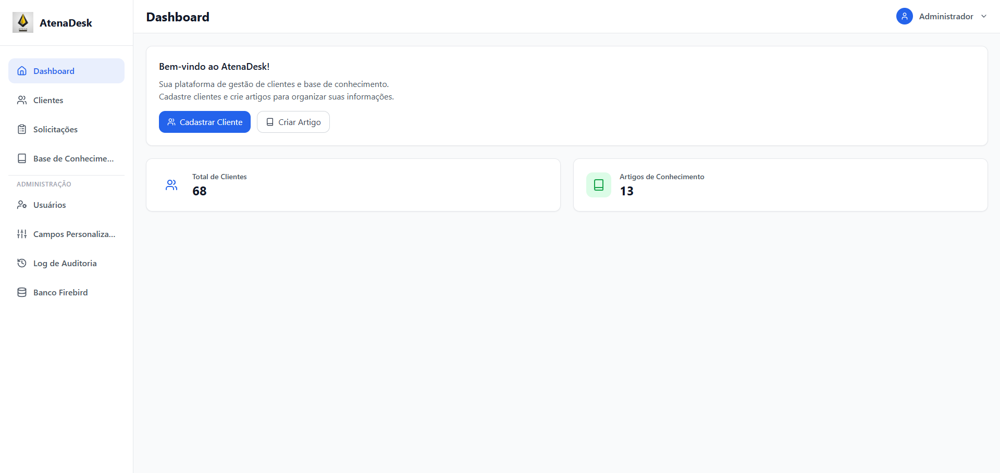
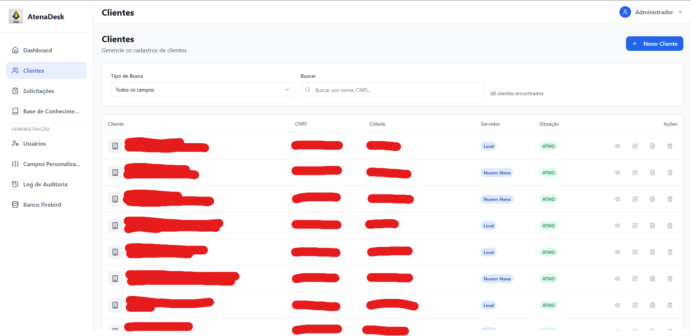
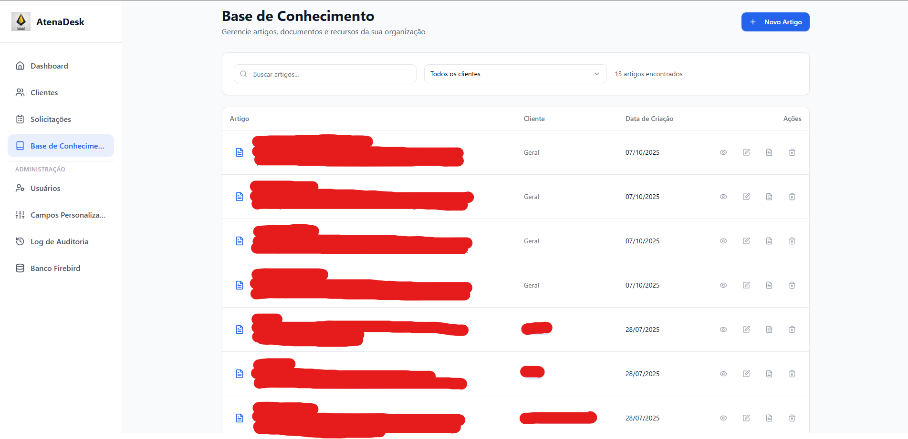
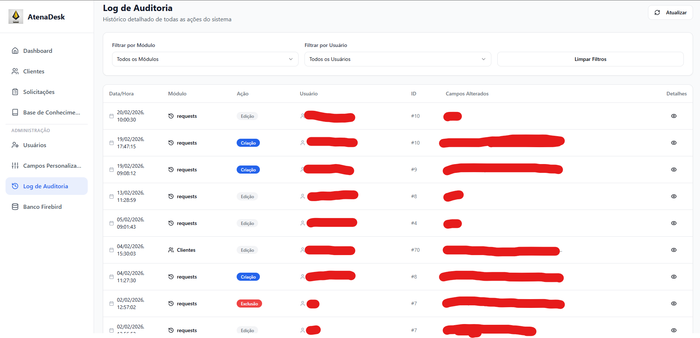
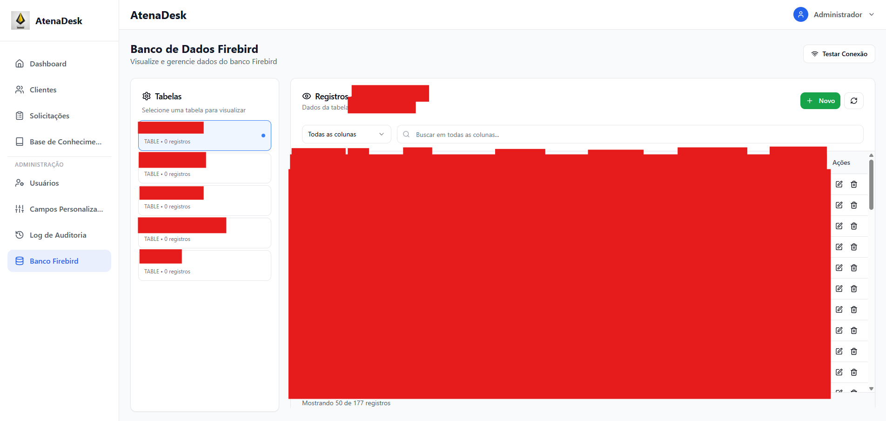

# AtenaDesk — Internal Platform Engineering

> **Real-world internal platform designed and developed for a private software company.**

AtenaDesk is a full-stack internal management platform I designed and developed to centralize workflows used by **customer support, engineering, and administration teams**.

The project was created from problems observed directly in daily operations: customer information distributed across different tools, requests without centralized tracking, internal knowledge stored in individual notes, and operational processes dependent on specific people.

AtenaDesk brings these workflows together into a single web-based platform.

> 🔒 **Proprietary Project**
>
> The production source code, internal endpoints, infrastructure details, credentials, and company/customer data are proprietary and cannot be published.
>
> This repository provides a **public technical overview of a real project I developed**, focusing on the product, architecture, engineering decisions, and my contribution.

---

## 🎯 The Problem

Several operational processes were fragmented across different tools, emails, conversations, and individual notes.

This created challenges such as:

* Customer information without a standardized central source
* Support and development requests with limited visibility and ownership
* Internal knowledge distributed across different people
* Repetitive questions and support procedures
* Operational activities dependent on specific employees
* Limited traceability of internal changes

The goal was to create a centralized system that could simplify these workflows while remaining practical for a small team.

---

## 💡 The Solution

AtenaDesk was developed as an internal platform combining:

**Customer Management + Helpdesk + Knowledge Base + Administrative Tools**

The platform provides a shared environment where teams can manage customer information, track requests, document internal knowledge, control access, audit operations, and interact with selected legacy-system workflows.

---

## 🖥️ Application Preview

### Dashboard

Central overview of the platform and its main operational areas.



### Customer Management

Centralized customer records with structured information, search, filtering, and configurable fields.



### Knowledge Base

Shared internal knowledge for procedures, troubleshooting information, training material, and customer-specific documentation.



### Audit Log

Traceability of important actions performed within the platform.



### Legacy System Administration

Restricted administrative interface used to access selected workflows connected to the company's legacy Firebird environment.



> Screenshots presented in this repository contain only information suitable for public portfolio presentation. Sensitive company, infrastructure, and customer information is intentionally excluded.

---

## ✨ Core Features

### 👥 Customer Management

* Standardized customer profiles
* Required fields and validation
* Search, filtering, and pagination
* Administrator-defined custom fields
* Customer-specific operational information

### 🎫 Request Management

Requests can be associated with customers and routed between support and engineering teams.

The system provides:

* Customer-linked requests
* Department assignment
* Kanban-style lifecycle
* Status and ownership tracking
* Attachments for additional context

Typical workflow:

```text
Requested → In Review → In Progress → Done
```

### 📚 Knowledge Base

A shared internal knowledge base centralizes information that was previously distributed across individual notes and team members.

It supports:

* Procedures and troubleshooting guides
* Internal tips and training material
* Global articles
* Customer-specific articles
* File attachments
* Structured contextual information

### 🔐 Access Control & Administration

Administrative functionality includes:

* User management
* Role-based access control
* Protected functionality based on permissions
* Custom field management
* Audit log visualization
* Restricted legacy-system operations

### 🧾 Audit Logging

Important operations are recorded to improve traceability and accountability.

The system tracks information such as:

* Who performed an action
* What operation was performed
* When the action occurred

### 🔌 Legacy System Integration

AtenaDesk includes an integration path with a legacy **Firebird database** used in license-related operational workflows.

This allows selected legacy operations to be accessed through the new platform while maintaining controlled permissions and system boundaries.

---

## 🏗️ Architecture

AtenaDesk follows a **modular monolith** architecture designed to keep deployment and maintenance straightforward for a small team while preserving clear boundaries between application domains.

```text
┌───────────────────────────────┐
│          React UI             │
├───────────────────────────────┤
│          Express API          │
├───────────────────────────────┤
│      Application Modules      │
│                               │
│  Auth        Clients          │
│  Requests    Knowledge Base   │
│  Admin       Audit Logs       │
│  Legacy Integration           │
├───────────────────────────────┤
│       Data Access Layer       │
├────────────────┬──────────────┤
│   PostgreSQL   │   Firebird   │
│    Primary     │    Legacy    │
└────────────────┴──────────────┘
```

---

## 🛠️ Tech Stack

**Frontend**

`React` · `TypeScript`

**Backend**

`Node.js` · `Express` · `TypeScript`

**Data & Validation**

`PostgreSQL` · `Firebird` · `Drizzle` · `Zod`

**Engineering**

`Modular Monolith` · `REST APIs` · `Role-Based Access Control` · `Audit Logging` · `File Uploads` · `Legacy System Integration` · `WebSockets`

---

## 👨‍💻 My Role

I worked across multiple stages of the project, including:

* Identifying operational problems and requirements
* Translating support workflows into software requirements
* Designing the application architecture
* Defining the data model
* Designing application and UX flows
* Developing frontend and backend functionality
* Building customer management workflows
* Implementing request lifecycle management
* Building the internal knowledge base
* Implementing users, roles, and permissions
* Implementing audit logging
* Designing the integration with the legacy Firebird environment
* Iterating on the platform based on real operational needs

My experience working directly with technical support operations was particularly important because many of AtenaDesk's requirements originated from problems encountered in daily use.

---

## 📈 Operational Impact

AtenaDesk was designed to improve internal operations by:

* Centralizing customer information
* Standardizing customer registration
* Improving visibility and ownership of requests
* Reducing lost or delayed internal requests
* Providing a shared source of support knowledge
* Reducing dependency on information held by individual employees
* Making selected operational workflows accessible through controlled permissions
* Increasing traceability through audit logs

The project demonstrates how experience across **technical support, business operations, and software development** can be combined to build practical internal tools.

---

## 🔒 Source Code & Confidentiality

AtenaDesk was developed for a private software company and contains proprietary business logic, internal integrations, infrastructure details, and company-related information.

For confidentiality and security reasons, this repository does **not** include:

* Production source code
* Internal endpoints or URLs
* Credentials or secrets
* Infrastructure configuration
* Real customer information
* Internal database dumps
* Sensitive company data

The purpose of this repository is to present the **product, engineering work, architecture, and my technical contribution** without exposing proprietary assets.

---

## 👤 Author

**Matheus Longhi Cordeiro**

Software Developer with experience in web applications, internal business tools, technical support, and AI-assisted software development.

[GitHub](https://github.com/MatheusLC99) · [LinkedIn](https://www.linkedin.com/in/matheus-longhi-cordeiro-878725b6) · [Portfolio](https://matheusdevcode.com.br)
